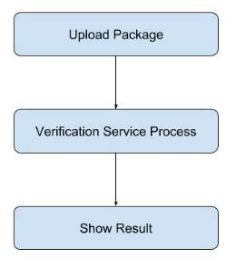
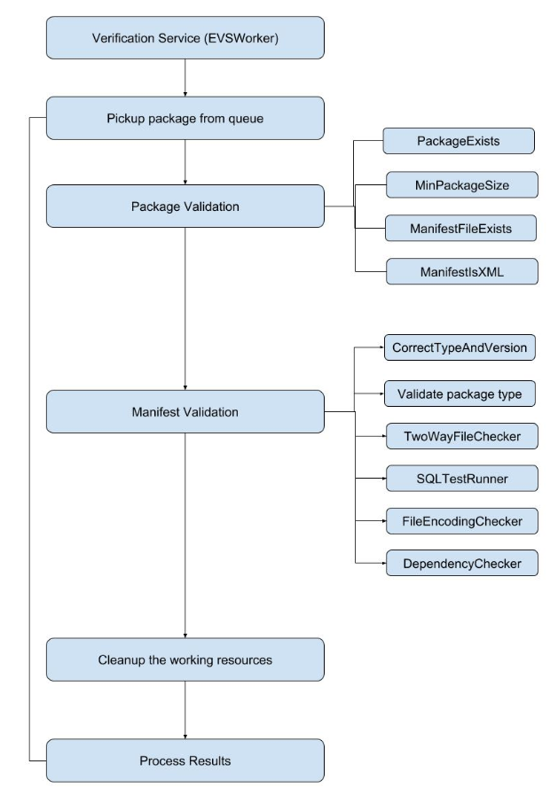

# DNN (formerly DotNetNuke) Extension Verification Service

## Project Description
EVS attempts to simplify the extension development and testing process by automating some of the initial compatibility checks. Currently EVS conducts this compatibility checking by focusing on three key areas which include the package manifest, SQL scripts and assemblies.

### Major Architecture
* Website Flow

* EVS Worker Flow

### Solution Project
* EVSAppController (Database Layer)
* EVSWebAPI (API site)
* EVSWebAPIService (API deployment)
* EVSWorker (Background service for package verification)
* EVSWorkerService (Background service deployment)
* PackageVerification (Rules for package verification)
* PackageVerification.AssemblyScanner (Support project for assemblies verification)
* PackageVerification.AssemblyScanner.ConsoleApp (Support project for basic information, such as application version, sql server version)
* PackageVerification.SQLRunner (Running sql scripts)
* PackageVerification.SqlScanner (Scan sql scripts)
* evswebsite (User Interface Site)
